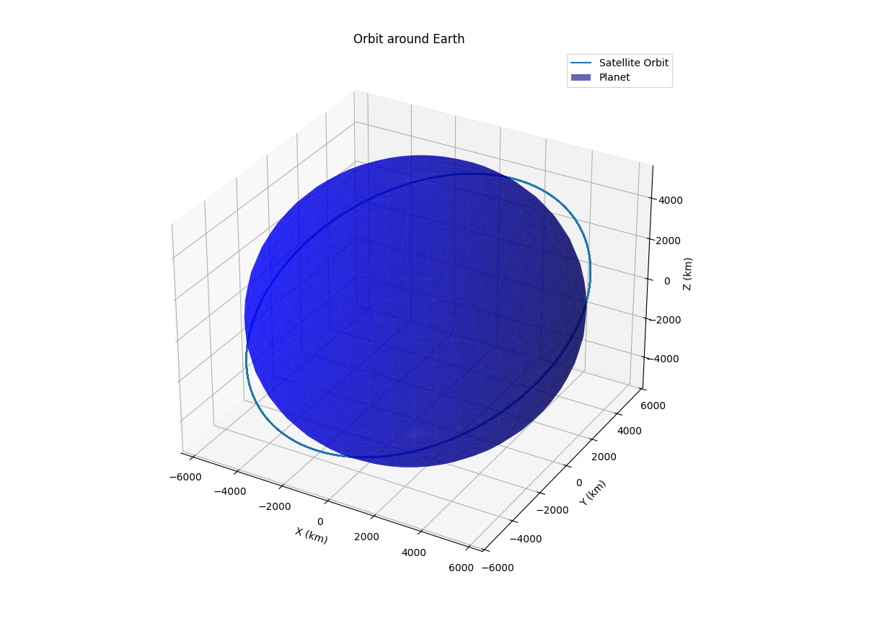
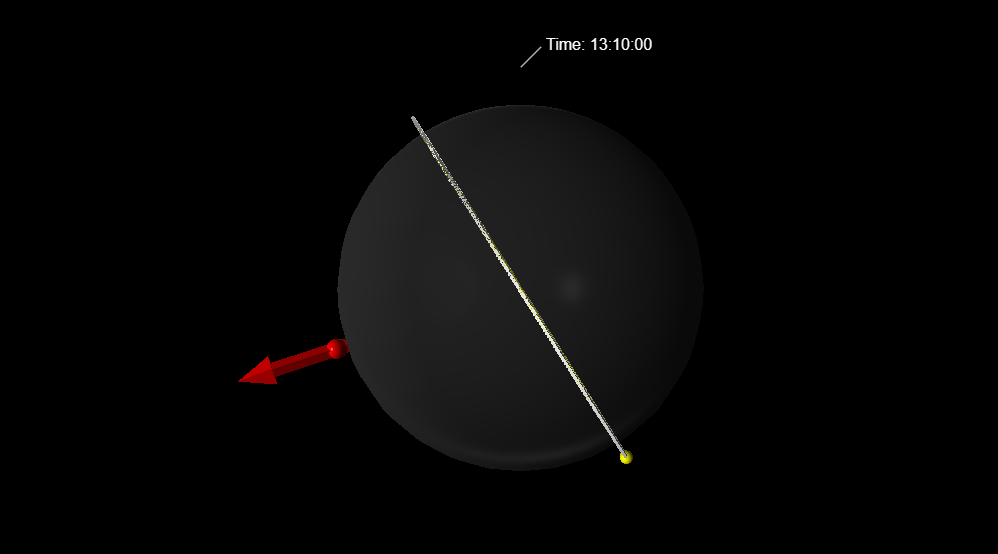
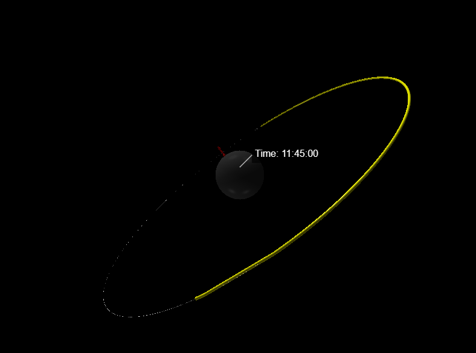

### README.md
# Orbital Mechanics Simulation 

This is a Python simulator for modeling satellite orbits using classical orbital mechanics, with two perturbation effects (J2, atmospheric drag) and support for orbital maneuvers (Hohmann transfers). The Project also includes 2D (Graph) / 3D(Visual Python) visualizations.

Earth and Hubble Telescope: 

James Webb Space Telescope around Sun:

## Features
- Orbital propagation using numerical integration (RK4, etc.)
- Perturbations: J2 effect, atmospheric drag
- Orbital maneuvers: Hohmann transfers
- Two Line Element Compatible
- 2D/3D visualization of orbits
- Real-world TLE comparison support
- Some examples of fameous satellite TLEs

## Usage
- Paste the TLEs or enter the data into 'src/sim_config.py' to chnage the parameters of the satellite
- Change the celestrial Body by entering values in the 'src/utils.py' file
- Run the main simulation

2D visualization visible

3D visualization visible for the assigned time

